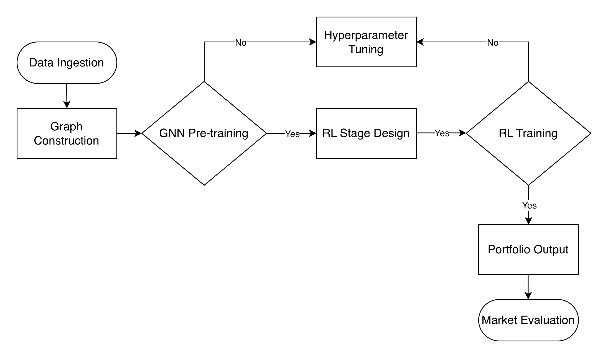
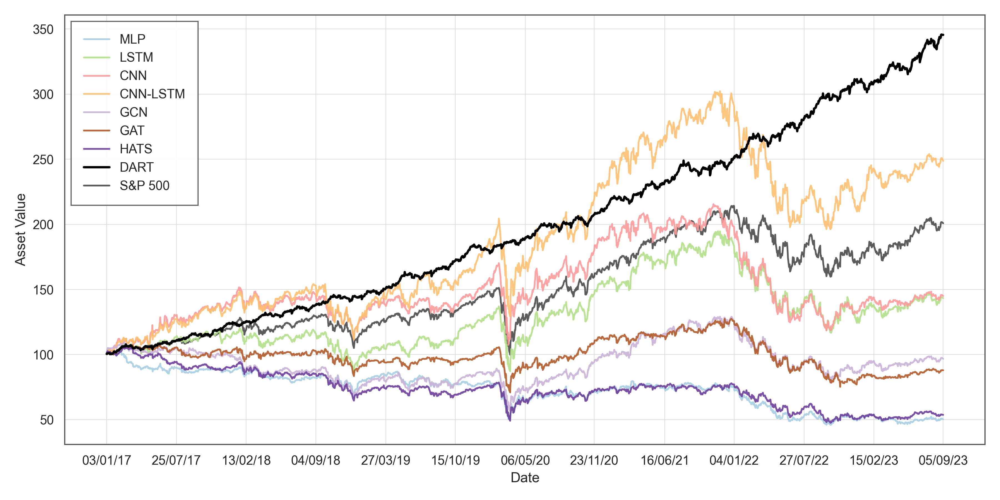
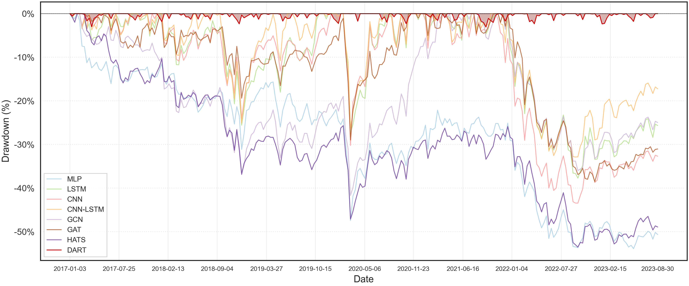

# DART: Dynamic Attention & Reinforcement Trading

**A framework integrating dynamic graph neural networks with deep reinforcement learning for automated, risk-aware portfolio management and stock trading.**

---

## Table of Contents

1. [Overview](#overview)
2. [Installation & Dependencies](#installation--dependencies)
3. [Usage](#usage)
4. [Project Architecture](#project-architecture)
5. [Pipeline Overview](#pipeline-overview)
6. [Results & Architecture](#results--architecture)
7. [Technologies Used](#technologies-used)
8. [Baseline Models](#baseline-models)
9. [Limitations & Future Work](#limitations--future-work)
10. [License](#license)
11. [Contact & Support](#contact--support)

---

## Overview

DART addresses two critical limitations in existing stock market prediction systems. First, most graph-based approaches rely on static knowledge graphs that fail to capture the dynamic nature of relationships of market entities. Second, prediction-focused models do not translate directly into actionable trading strategies or account for practical portfolio management constraints like volatility, drawdown, and transaction costs.

**DART** resolves these issues by combining:

- **Dynamic Graph Neural Networks**: Constructs time-varying adjacency matrices from sliding-window price correlations to capture evolving inter-stock dependencies, enriched with technical indicators (MACD, RSI, Bollinger Bands, ADX, OBV).
- **Hierarchical Attention Mechanisms**: Applies two-level attention mechanism—state-level attention across neighbors within each relation type, and relation-level attention across both static corporate relations (58 relation types) and dynamic price correlations.
- **Reinforcement Learning with PPO**: Uses Proximal Policy Optimization to learn a long-only portfolio allocation policy that directly optimizes a risk-aware reward function incorporating returns, volatility, downside risk, drawdown, and transaction costs.

The framework is evaluated on the top 100 stocks of the S&P 500 based on market capitalization, which is broken into 12 temporal phases spanning different market regimes, demonstrating superior robustness compared to independent (MLP, LSTM, CNN, CNN-LSTM) and graph-based baseline models (GCN, GAT, HATS).

---

## Installation & Dependencies

### Requirements

Before running DART, ensure you have `Python 3.8` installed.

### Step 1: Install Dependencies

Install all required packages:

```bash
pip install -r requirements.txt
```

### Step 2: Prepare Data

The data directory structure should contain:

```
data/
├── price/              # Stock price data in CSV format
├── relation/           # Corporate relation files (direct.csv, 2hop.csv, raw_relations.csv)
├── properties.txt      # Wikidata properties mapping
├── tickers.txt         # List of stock tickers (one per line)
├── processed/          # Cached adjacency matrices and relation counts
├── returns.csv         # Pre-computed log returns
└── snp500_returns.csv  # Benchmark returns for comparison and plotting
```

---

## Usage

### 1. Run DART (GNN + Reinforcement Learning)

The main DART pipeline trains the GNN model first, then uses the trained GNN representations to initialize and train the RL agent.

```bash
python3 rl.py
```

This command runs the complete DART training pipeline with default hyperparameters. The framework is highly configurable—all training, model, and environment parameters can be customized via command-line arguments.

**Configuring Hyperparameters:**

To view all available configuration options and their descriptions, run:

```bash
python3 config.py --help
```

This will display comprehensive documentation for all parameters organized into logical groups:

- **Directories and Paths**: Data locations, checkpoint directories, logging paths
- **Data Parameters**: Feature lists, temporal phase settings, lookback windows, correlation thresholds
- **GNN Model Parameters**: Node feature dimensions, attention mechanisms, dropout rates, neighbor sampling
- **Training Parameters**: Learning rates, epochs, gradient clipping
- **RL Simulator Parameters**: Episode counts, reward function weights, volatility/drawdown penalties, transaction costs, turbulence thresholds

**Example with custom hyperparameters:**

```bash
python3 rl.py --n_epochs 200 --num_episodes 5000 --lr 1e-3 --initial_balance 500000 --transaction_cost 0.0005
```

**Output:** Trained PPO agents, GNN checkpoints, and performance metrics saved in `logs/rl_results/`.

### 2. Train and Evaluate GNN Only

For stock movement prediction without RL:

```bash
python3 model.py
```

This trains the GNN on 12-phase walk-forward validation, saves model checkpoints, and evaluates prediction accuracy on held-out test sets.

**Output:** Performance metrics saved in `logs/gnn_results/`. Checkpoints saved in `logs/checkpoints/phase_X/`.

### 3. Run Baseline Models

The `baseline_models/` directory contains implementations of 7 baseline architectures for comparison:

```bash
# Train HATS (Hierarchical Attention) baseline
python3 baseline_models/HATSModel.py
```

Each baseline model:
- Uses the same dataset and temporal split strategy
- Applies a heuristic trading rule: allocate capital proportional to prediction confidence
- Outputs backtesting metrics (Sharpe, Sortino, Max Drawdown, Alpha, Beta)

**Output:** Results saved in `baseline_models/logs/`.

---

## Project Architecture

### Directory Structure

```
DART/
├── config.py                         # Global configuration and hyperparameters
├── model.py                          # GNN architecture and training pipeline
├── dataset.py                        # Data loading, preprocessing, windowing
├── rl.py                             # RL environment and training logic
│
├── baseline_models/
│   ├── CNNModel.py                   # CNN baseline
│   ├── LSTMModel.py                  # LSTM baseline
│   ├── CNN_LSTMModel.py              # CNN-LSTM baseline
│   ├── GCNModel.py                   # GCN baseline
│   ├── GAT.py                        # Graph Attention Network baseline
│   ├── HATSModel.py                  # Hierarchical Attention Network baseline
│   ├── MLPModel.py                   # MLP baseline
│   ├── dataset_baseline_models.py    # Dataset for baselines
│   ├── trading_strategy.py           # Backtesting logic for baselines
│   └── logs/                         # Baseline results
│
├── data/
│   ├── price/                        # Stock price data files (100 S&P 500 stocks)
│   ├── relation/                     # Corporate relation graphs
│   ├── processed/                    # Cached adjacency matrices
│   ├── properties.txt                # Company metadata
│   ├── tickers.txt                   # Stock symbols
│   ├── returns.csv                   # Aggregated log returns
│   └── snp500_returns.csv            # Market benchmark
│
├── logs/
│   ├── checkpoints/                  # GNN model checkpoints per phase
│   ├── gnn_results/                  # GNN prediction metrics
│   └── rl_results/                   # RL training results and agents
│
├── other/
│   ├── flowchart.png                 # Visual architecture diagram (mandatory)
│   ├── asset_value.py                # Portfolio cumulative value over time
│   ├── drawdown.py                   # Maximum drawdown visualization
│   ├── rolling_sharpe_ratio.py       # 90-day rolling Sharpe ratio
│   ├── phase_visualization.py        # Market regimes and phase markers
│   └── (Created Visualizations from the scripts)
│
├── requirements.txt                  # Python dependencies
├── README.md                         
└── LICENSE                           # Project license
```

---

## Pipeline Overview

### 1. Data Preparation & Technical Indicators

Raw price data is loaded from Yahoo Finance. For each stock and timestep, the following features are computed:

- **Log Returns**: Daily price changes in log space
- **MACD (Moving Average Convergence Divergence)**: 12-day EMA, 26-day EMA, 9-day signal line
- **RSI (Relative Strength Index)**: 14-day momentum oscillator
- **Bollinger Bands**: 20-day SMA, upper/lower bands (2σ), band width, percentage position
- **ADX (Average Directional Index)**: ADX, ADXR, +DI, -DI for trend strength
- **OBV (On-Balance Volume)**: Cumulative volume indicator

All features are normalized using Min-Max scaling per phase to ensure numerical stability.

### 2. Dynamic Graph Construction

The framework builds a relational graph at each timestep combining:

- **Static Relations**: 58 corporate relation types (supply chain, sector, subsidiary, etc.) sourced from Wikidata
- **Dynamic Relations**: Price correlation adjacency matrix computed from a rolling 50-day window. Edges are included if correlation magnitude exceeds a certain threshold.

### 3. GNN Feature Extraction

The GNN module processes temporal stock data and learns relational representations through a two-level attention mechanism:

**LSTM Processing**: Temporal feature sequences (50-day lookback) are encoded via LSTM (128 units).

**Hierarchical Attention**: Two levels of attention weight and aggregate information:

- **State-Level**: Neighbors within each relation type $m$ are weighted by relevance.

- **Relation-Level**: Different relation types are aggregated.

**Node Update**: Residual connection preserves original signal.

These learned representations serve as features for both stock movement classification and the RL agent.

### 4. Stock Movement Classification (Supervised Training)

The GNN predicts stock movement (Up/Neutral/Down) using cross-entropy loss. This supervised pre-training phase learns the feature extractor before the RL agent begins trading.

### 5. Portfolio Management via Reinforcement Learning

**Environment State**: The RL agent's observation combines GNN features and portfolio state:

$$s_t = [\text{vec}(H_t) \| \text{vec}(Y_t) \| w_t \| c_t \| \mu_t \| \bar{\sigma}_t \| T_t \| \phi_t]$$

- $vec(H_t)$: GNN embeddings (128-dim per stock)
- $vec(Y_t)$: Movement probabilities (3-dim per stock)
- $w_t$: Portfolio weights vector
- $c_t$: cash ratio
- $\mu_t$: Bullish/bearish sentiment ratio
- $\bar{\sigma}_t$: The average prediction confidence across all stocks
- $T_t$: Market turbulence index
- $\phi_t$: Time indicator representing position within trading period

**Action Space**: Portfolio weight allocation across cash and $N$ stocks:

$$a_t = [\text{cash\\_weight}, \text{stock\\_1\\_weight}, \ldots, \text{stock\\_N\\_weight}] \in [0,1]^{N+1}$$

**Reward Function**: Balances returns against multiple risk penalties:

$$R_t = r_t^{portfolio} - w_{vol} \cdot \sigma_{t}^{gen} - w_{down} \cdot \sigma_{t}^{down} - w_{dd} \cdot \text{DD}_t - w_{cost} \cdot C_{t}$$

Where: $r_t^{portfolio}$ = daily return, $\sigma_{t}^{gen}$ and $\sigma_{t}^{down}$ = volatility penalties, $\text{DD}_t$ = drawdown, and weights balance risk-return tradeoff.

### 6. Multi-Phase Walk-Forward Validation

The dataset splits into 12 sequential phases to evaluate performance across different market regimes:

- **Phase Structure**: 350 training days | 70 validation days | 140 test days
- **Sliding Window**: Each phase advances 140 days (non-overlapping but contiguous test sets)
- **Adaptive Training**: Models retrain from scratch per phase to prevent look-ahead bias

This approach mirrors real-world deployment where models periodically update with new market data.

---

## Results & Architecture

The architectural flowchart below illustrates the complete data flow:



### Performance Summary

DART significantly outperforms baseline models across all market regimes. During market stress (Phase 9, late 2021 volatility), DART maintained a Sharpe ratio of +2.42 while all baselines turned negative (-1.49 to -2.16). The RL agent adapts its policy dynamically, shifting to defensive positions during downturns while capturing upside during bull markets.

### Key Visualizations

Performance metrics and analysis across trading phases:


<p align="center">Portfolio value evolution over time for all models. Each model starts out with
$100.</p>


<p align="center">An underwater plot depicting the magnitude and duration of portfolio draw-
downs throughout the evaluation timeline.</p>

---

## Technologies Used


---

## Baseline Models

For comprehensive comparison, DART is evaluated against 7 baselines organized into two categories:

### Independent Models
- **MLP**: 2-layer fully connected network (64 → 32 units)
- **LSTM**: 2-layer LSTM (64 → 32 units) with batch normalization
- **CNN**: 2-layer convolutional network (32, 8 filters)
- **CNN-LSTM**: Hybrid CNN (32 filters) → LSTM (50 units)

### Graph-Based Models
- **GCN**: LSTM (64) + 2 Graph Convolutional layers
- **GAT**: LSTM (32) + 2 Graph Attention layers (4 heads)
- **HATS**: GRU (128) + Hierarchical Attention (original architecture)

All baselines use the same:
- Dataset and temporal splits (12 phases)
- Feature engineering (technical indicators)
- Heuristic trading rule: allocate capital proportional to confidence

This fair comparison ensures differences are attributable to modeling approach, not data or evaluation protocol.

---

## Limitations & Future Work

1. **Limited Asset Universe**: Evaluation restricted to top 100 S&P 500 stocks. Expansion to small-cap stocks or international markets would test robustness under lower liquidity and different market dynamics.

2. **Single Agent Architecture**: Current implementation uses one PPO agent. Multi-agent ensemble approaches (e.g., separate agents for trend-following vs. mean-reversion) could improve regime-specific performance.

3. **Simplified Transaction Costs**: Model assumes fixed percentage costs. Integration of realistic market impact models and slippage would provide stricter evaluation of actual trading profitability.

4. **Static Corporate Relations**: Wikidata relations remain fixed over time; dynamic update of corporate graphs could capture structural market changes.


---

## License

This project is licensed under the MIT License – see the [LICENSE](./LICENSE) file for details.

---

## Contact & Support

For questions, bug reports, or collaboration inquiries:

- **Author**: Dhruv Jain (Indian Institute of Technology Kharagpur)
- **Email**: generalruv@gmail.com
- **GitHub Issues**: https://github.com/Dhruv2676/DART

---

**Last Updated**: January 2026